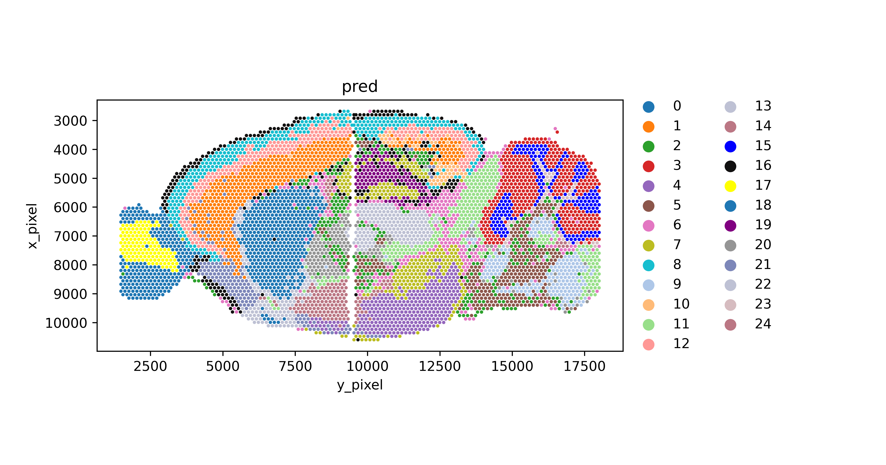

# Spatial-domain-detection-using-hypergraph
We propose a spatial transcriptomics domain detection pipeline using a hypergraph autoencoder. Instead of using graphs, hypergraphs could be a great option for capturing complex relationships among cells, and the evaluation metrics show that our model is superior to all other methods.

